# Versijų aprašymai:

## v.pradinė:
### Duomenų nuskaitymas, studentų struktūros sukūrimas, galutinio balo suskaičiavimas
### su vidurkiu arba mediana. Taip pat ir duomenų išvedimas.

## v0.1:
### Padaryta, kad programa veiktų, nežinant kiek bus namų darbų ar studentų ir realizuota 
### su C masyvu ir vektoriais. Dar padaryta, kad vartotojas galėtų pasirinkti sugeneruoti duomenis.

## v0.2:
### Padaryta, kad duomenis eitų gauti iš tekstinio failo ir kad naudotojas galėtų pasirinkti,
### pagal ką rūšiuoti. Taip pat reikėjo ištestuoti skirtingo dydžio failus (greitį).

## v0.3:
### Kur tikslinga programoje pradėta naudoti struktūras, daug funkcijų ir duomenų tipų perkėlti 
### į skirtingus header ar .cpp files. Pridėtas minimalus išimčių valdymas.

## v0.4:
### Sukurta failų generavimo funkcija, surūšiuoti studentai pagal dvi kategorijas 
### (nuskriaustukai, jei galutinis balas < 5.0, o kietiakai, jei galutinis balas >= 5.0)
### ir jie išvesti į du skirtingus failus.
### Atlikta programos veikimo greičio (spartos) analizė.

## v1.0:
### Konteinerių testavimas (sukurtos list ir deque programos ir visų laikai ištestuoti priskaitant vektorius).
### Optimizuota studentų rūšiavimo (dalijimo) į dvi kategorijas realizacija.

# v0.4 Tyrimai
## 1 Tyrimas:
* Laikui skaičiuoti naudoju chrono biblioteka ir Timer klasę.
* Naudoju -O3 vėliavėlę kompiliavimui.
### 1) Testuosiu 1 tūkstančio studentų failo sukūrimo ir uždarymo laiką.
* Kai yra 1 tūkstantis studentų, kiekvienas turi po 10 namų darbų ir vieną egzamino rezultatą.
* Pirmas bandymas:

* 1 tūkst. studentų generavimo laiko testavimų lentelė

| 1 testas | 2 testas | 3 testas | 4 testas | 5 testas | Vidurkis |
|----------|----------|----------|----------|----------|----------|
| 0.0213 s | 0.0113 s | 0.0130 s | 0.0109 s | 0.0101 s | 0.0107  s|

### 2) Testuosiu 10 tūkstančių studentų failo sukūrimo ir uždarymo laiką.
* Kai yra 10 tūkstančių studentų, kiekvienas turi po 15 namų darbų ir vieną egzamino rezultatą.
* Pirmas bandymas:

* 10 tūkst. studentų generavimo laiko testavimų lentelė

| 1 testas | 2 testas | 3 testas | 4 testas | 5 testas | Vidurkis |
|----------|----------|----------|----------|----------|----------|
| 0.0407 s | 0.0408 s | 0.0482 s | 0.0565 s | 0.0385 s | 0.0449 s |

### 3) Testuosiu 100 tūkstančių studentų failo sukūrimo ir uždarymo laiką.
* Kai yra 100 tūkstančių studentų, kiekvienas turi po 20 namų darbų ir vieną egzamino rezultatą.
* Pirmas bandymas:

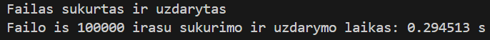
* 100 tūkst. studentų generavimo laiko testavimų lentelė

| 1 testas | 2 testas | 3 testas | 4 testas | 5 testas | Vidurkis |
|----------|----------|----------|----------|----------|----------|
| 0.2945 s | 0.2831 s | 0.2908 s | 0.2855 s | 0.2829 s | 0.2873 s |

### 4) Testuosiu 1 milijono studentų failo sukūrimo ir uždarymo laiką.
* Kai yra 1 milijonas studentų, kiekvienas turi po 7 namų darbus ir vieną egzamino rezultatą.
* Pirmas bandymas:

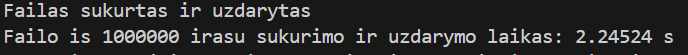
* 1 milijono studentų generavimo laiko testavimų lentelė

| 1 testas | 2 testas | 3 testas | 4 testas | 5 testas | Vidurkis |
|----------|----------|----------|----------|----------|----------|
| 2.2452 s | 2.1820 s | 2.1587 s | 2.3350 s | 2.2060 s | 2.2253 s |

### 5) Testuosiu 10 milijonų studentų failo sukūrimo ir uždarymo laiką.
* Kai yra 10 milijonų studentų, kiekvienas turi po 5 namų darbus ir vieną egzamino rezultatą.
* Pirmas bandymas:

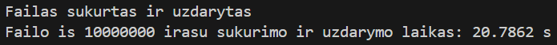
* 10 milijonų studentų generavimo laiko testavimų lentelė

| 1 testas | 2 testas | 3 testas | 4 testas | 5 testas | Vidurkis |
|----------|----------|----------|----------|----------|----------|
| 20.786 s | 22.255 s | 21.093 s | 20.908 s | 21.502 s | 21.308 s |

## 2 Tyrimas:
### 1) Testuosiu 1 tūkstančio studentų failo nuskaitymo, rūšiavimo, išvedimo į du naujus failus ir visos programos veikimo laiką.
* Pirmas bandymas:

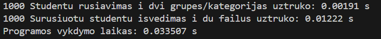
* 1 tūkst. studentų laiko testavimų lentelė

| Matavimas   | 1 testas | 2 testas | 3 testas | 4 testas | 5 testas | Vidurkis |
|-------------|----------|----------|----------|----------|----------|----------|
| Nuskaitymas | 0.0033 s | 0.0017 s | 0.0029 s | 0.0033 s | 0.0027 s | 0.0027 s |
| Rūšiavimas  | 0.0019 s | 0.0018 s | 0.0020 s | 0.0005 s | 0.0016 s | 0.0015 s |
| Išvedimas   | 0.0122 s | 0.0058 s | 0.0145 s | 0.0057 s | 0.0137 s | 0.0103 s |
| Vykdymas    | 0.0335 s | 0.0153 s | 0.0364 s | 0.0183 s | 0.0288 s | 0.0264 s |

### 2) Testuosiu 10 tūkstančių studentų failo nuskaitymo, rūšiavimo, išvedimo į du naujus failus ir visos programos veikimo laiką.
* Pirmas bandymas:

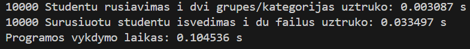
* 10 tūkst. studentų laiko testavimų lentelė

| Matavimas   | 1 testas | 2 testas | 3 testas | 4 testas | 5 testas | Vidurkis |
|-------------|----------|----------|----------|----------|----------|----------|
| Nuskaitymas | 0.0225 s | 0.0162 s | 0.0147 s | 0.0167 s | 0.0160 s | 0.0172 s |
| Rūšiavimas  | 0.0030 s | 0.0024 s | 0.0026 s | 0.0025 s | 0.0027 s | 0.0026 s |
| Išvedimas   | 0.0334 s | 0.0350 s | 0.0348 s | 0.0295 s | 0.0434 s | 0.0352 s |
| Vykdymas    | 0.1045 s | 0.1225 s | 0.0973 s | 0.0902 s | 0.1054 s | 0.1039 s |

### 3) Testuosiu 100 tūkstančių studentų failo nuskaitymo, rūšiavimo, išvedimo į du naujus failus ir visos programos veikimo laiką.
* Pirmas bandymas:

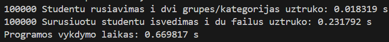
* 100 tūkst. studentų laiko testavimų lentelė

| Matavimas   | 1 testas | 2 testas | 3 testas | 4 testas | 5 testas | Vidurkis |
|-------------|----------|----------|----------|----------|----------|----------|
| Nuskaitymas | 0.1659 s | 0.1538 s | 0.1474 s | 0.1463 s | 0.1419 s | 0.1510 s |
| Rūšiavimas  | 0.0183 s | 0.0224 s | 0.0144 s | 0.0226 s | 0.0151 s | 0.0185 s |
| Išvedimas   | 0.2317 s | 0.3066 s | 0.2719 s | 0.3195 s | 0.3220 s | 0.2903 s |
| Vykdymas    | 0.6698 s | 0.8447 s | 0.7171 s | 0.7885 s | 0.8503 s | 0.7740 s |

### 4) Testuosiu 1 milijono studentų failo nuskaitymo, rūšiavimo, išvedimo į du naujus failus ir visos programos veikimo laiką.
* Pirmas bandymas:

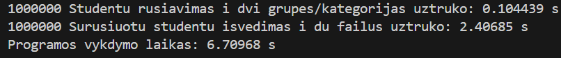
* 1 milijonų studentų laiko testavimų lentelė

| Matavimas   | 1 testas | 2 testas | 3 testas | 4 testas | 5 testas | Vidurkis |
|-------------|----------|----------|----------|----------|----------|----------|
| Nuskaitymas | 0.7563 s | 0.8295 s | 0.7762 s | 0.7925 s | 0.7996 s | 0.7908 s |
| Rūšiavimas  | 0.1044 s | 0.1073 s | 0.1048 s | 0.1444 s | 0.1061 s | 0.1134 s |
| Išvedimas   | 2.4068 s | 2.3731 s | 2.3550 s | 2.2063 s | 2.2354 s | 2.3153 s |
| Vykdymas    | 6.7096 s | 5.9877 s | 5.9002 s | 5.6726 s | 5.7194 s | 5.9979 s |

### 5) Testuosiu 10 milijonų studentų failo nuskaitymo, rūšiavimo, išvedimo į du naujus failus ir visos programos veikimo laiką.
* Pirmas bandymas:

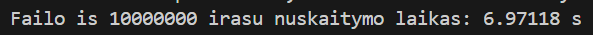
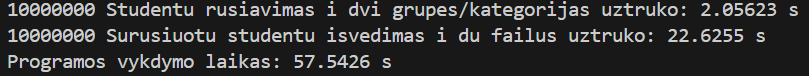
* 10 milijonų studentų laiko testavimų lentelė

| Matavimas   | 1 testas | 2 testas | 3 testas | 4 testas | 5 testas | Vidurkis |
|-------------|----------|----------|----------|----------|----------|----------|
| Nuskaitymas | 6.9711 s | 6.9106 s | 6.9154 s | 6.8950 s | 6.8858 s | 6.9155 s |
| Rūšiavimas  | 2.0562 s | 1.1321 s | 1.1247 s | 1.3328 s | 2.2125 s | 1.5716 s |
| Išvedimas   | 22.625 s | 22.870 s | 22.930 s | 23.087 s | 23.175 s | 22.937 s |
| Vykdymas    | 57.542 s | 58.066 s | 59.858 s | 59.207 s | 57.399 s | 58.414 s |

# v1.0 Tyrimai (Konteinerių testavimas)
### Mano nešiojamo kompiuterio (kurį naudoju testavimui) parametrai: 
* CPU: 13th Gen Intel(R) Core(TM) i7-13700H 2.40 GHz;
* RAM: 32 GB;
* System type: 64-bit operating system, x64-based processor;
* SSD: 500 GB.
### Testuoju, kai bendrą studentų konteinerį skaidau į du naujus to paties tipo konteinerius: "kietiakiai" ir "nuskriaustukai". Techniškai 1 strategija.
### "Rūšiavimas" reiškia studentų rūšiavimą didėjimo tvarką konteineryje su sort.
### "Skirstymas" reiškia studentų skirstymo į dvi grupes/kategorijas (naujų konteinerių su skirtingais studentais kūrimas).

## 1 Tyrimas (Be strategijų)
### 1) Testuosiu 1 tūkstančio studentų failo nuskaitymo, rūšiavimo, skirstymo į dvi grupes laiką su skirtingais konteineriais.

| Konteineris | Matavimas   | 1 testas | 2 testas | 3 testas | 4 testas | 5 testas | Vidurkis |
|-------------|-------------|----------|----------|----------|----------|----------|----------|
| Vektorius   | Nuskaitymas | 0.0028 s | 0.0053 s | 0.0048 s | 0.0030 s | 0.0056 s | 0.0043 s |
| Vektorius   | Rūšiavimas  | 0.404 ms | 0.301 ms | 0.231 ms | 0.185 ms | 0.266 ms | 0.277 ms |
| Vektorius   | Skirstymas  | 0.0072 s | 0.0031 s | 0.0030 s | 0.0022 s | 0.0025 s | 0.0036 s |
| List        | Nuskaitymas | 0.0047 s | 0.0064 s | 0.0069 s | 0.0070 s | 0.0048 s | 0.0059 s |
| List        | Rūšiavimas  | 0.247 ms | 0.168 ms | 0.209 ms | 0.157 ms | 0.460 ms | 0.249 ms |
| List        | Skirstymas  | 0.0035 s | 0.0036 s | 0.0035 s | 0.0034 s | 0.0035 s | 0.0034 s |
| Deque       | Nuskaitymas | 0.0063 s | 0.0059 s | 0.0042 s | 0.0056 s | 0.0031 s | 0.0050 s |
| Deque       | Rūšiavimas  | 0.858 ms | 0.839 ms | 0.288 ms | 0.858 ms | 0.464 ms | 0.661 ms |
| Deque       | Skirstymas  | 0.0033 s | 0.0033 s | 0.0028 s | 0.0034 s | 0.0034 s | 0.0032 s |

### 2) Testuosiu 10 tūkstančių studentų failo nuskaitymo, rūšiavimo, skirstymo į dvi grupes laiką su skirtingais konteineriais.

| Konteineris | Matavimas   | 1 testas | 2 testas | 3 testas | 4 testas | 5 testas | Vidurkis |
|-------------|-------------|----------|----------|----------|----------|----------|----------|
| Vektorius   | Nuskaitymas | 0.0077 s | 0.0081 s | 0.0072 s | 0.0059 s | 0.0069 s | 0.0071 s |
| Vektorius   | Rūšiavimas  | 0.0021 s | 0.0018 s | 0.0018 s | 0.0017 s | 0.0008 s | 0.0016 s |
| Vektorius   | Skirstymas  | 0.0044 s | 0.0045 s | 0.0043 s | 0.0041 s | 0.0041 s | 0.0043 s |
| List        | Nuskaitymas | 0.0093 s | 0.0057 s | 0.0092 s | 0.0087 s | 0.0069 s | 0.0080 s |
| List        | Rūšiavimas  | 0.0011 s | 0.0013 s | 0.0021 s | 0.0012 s | 0.0013 s | 0.0014 s |
| List        | Skirstymas  | 0.0031 s | 0.0032 s | 0.0044 s | 0.0039 s | 0.0012 s | 0.0032 s |
| Deque       | Nuskaitymas | 0.0111 s | 0.0096 s | 0.0112 s | 0.0108 s | 0.0067 s | 0.0099 s |
| Deque       | Rūšiavimas  | 0.0036 s | 0.0038 s | 0.0087 s | 0.0026 s | 0.0028 s | 0.0043 s |
| Deque       | Skirstymas  | 0.0071 s | 0.0073 s | 0.0052 s | 0.0055 s | 0.0055 s | 0.0061 s |

### 3) Testuosiu 100 tūkstančių studentų failo nuskaitymo, rūšiavimo, skirstymo į dvi grupes laiką su skirtingais konteineriais.

| Konteineris | Matavimas   | 1 testas | 2 testas | 3 testas | 4 testas | 5 testas | Vidurkis |
|-------------|-------------|----------|----------|----------|----------|----------|----------|
| Vektorius   | Nuskaitymas | 0.1626 s | 0.1572 s | 0.1627 s | 0.0181 s | 0.1618 s | 0.1329 s |
| Vektorius   | Rūšiavimas  | 0.0210 s | 0.0232 s | 0.0211 s | 0.0233 s | 0.0221 s | 0.0220 s |
| Vektorius   | Skirstymas  | 0.0212 s | 0.0226 s | 0.0181 s | 0.0222 s | 0.0164 s | 0.0206 s |
| List        | Nuskaitymas | 0.3337 s | 0.3353 s | 0.3407 s | 0.3309 s | 0.2808 s | 0.3087 s |
| List        | Rūšiavimas  | 0.0096 s | 0.0098 s | 0.0113 s | 0.0102 s | 0.0105 s | 0.0101 s |
| List        | Skirstymas  | 0.0802 s | 0.0875 s | 0.0785 s | 0.0847 s | 0.0875 s | 0.0842 s |
| Deque       | Nuskaitymas | 0.1742 s | 0.1392 s | 0.1739 s | 0.1724 s | 0.1507 s | 0.1556 s |
| Deque       | Rūšiavimas  | 0.0587 s | 0.0490 s | 0.0589 s | 0.0535 s | 0.0591 s | 0.0572 s |
| Deque       | Skirstymas  | 0.0343 s | 0.0428 s | 0.0417 s | 0.0441 s | 0.0385 s | 0.0402 s |

### 4) Testuosiu 1 milijono studentų failo nuskaitymo, rūšiavimo, skirstymo į dvi grupes laiką su skirtingais konteineriais.

| Konteineris | Matavimas   | 1 testas | 2 testas | 3 testas | 4 testas | 5 testas | Vidurkis |
|-------------|-------------|----------|----------|----------|----------|----------|----------|
| Vektorius   | Nuskaitymas | 0.7476 s | 0.7022 s | 0.6937 s | 0.7392 s | 0.7067 s | 0.7177 s |
| Vektorius   | Rūšiavimas  | 0.2702 s | 0.2695 s | 0.2626 s | 0.1420 s | 0.2713 s | 0.2335 s |
| Vektorius   | Skirstymas  | 0.1249 s | 0.1290 s | 0.1240 s | 0.1626 s | 0.1215 s | 0.1336 s |
| List        | Nuskaitymas | 1.3862 s | 1.3127 s | 1.3149 s | 1.1616 s | 1.4077 s | 1.3162 s |
| List        | Rūšiavimas  | 0.1112 s | 0.1223 s | 0.1149 s | 0.1137 s | 0.1295 s | 0.1214 s |
| List        | Skirstymas  | 0.2876 s | 0.2779 s | 0.3099 s | 0.2939 s | 0.2934 s | 0.2936 s |
| Deque       | Nuskaitymas | 0.9095 s | 0.8445 s | 0.8945 s | 0.8914 s | 0.8429 s | 0.8769 s |
| Deque       | Rūšiavimas  | 0.6868 s | 0.6954 s | 0.6877 s | 0.6779 s | 0.6919 s | 0.6855 s |
| Deque       | Skirstymas  | 0.2802 s | 0.2794 s | 0.2904 s | 0.2773 s | 0.2757 s | 0.2802 s |

### 5) Testuosiu 10 milijonų studentų failo nuskaitymo, rūšiavimo, skirstymo į dvi grupes laiką su skirtingais konteineriais.

| Konteineris | Matavimas   | 1 testas | 2 testas | 3 testas | 4 testas | 5 testas | Vidurkis |
|-------------|-------------|----------|----------|----------|----------|----------|----------|
| Vektorius   | Nuskaitymas | 6.5782 s | 7.0003 s | 7.0122 s | 7.2107 s | 7.0148 s | 6.9005 s |
| Vektorius   | Rūšiavimas  | 3.4127 s | 3.3642 s | 3.4868 s | 3.7064 s | 3.5045 s | 3.4744 s |
| Vektorius   | Skirstymas  | 1.3234 s | 1.2963 s | 1.3420 s | 1.3275 s | 1.3065 s | 1.3185 s |
| List        | Nuskaitymas | 9.2979 s | 10.866 s | 11.166 s | 11.125 s | 10.096 s | 10.110 s |
| List        | Rūšiavimas  | 1.4131 s | 1.4196 s | 1.4264 s | 1.4338 s | 1.4101 s | 1.4260 s |
| List        | Skirstymas  | 2.4258 s | 2.3532 s | 2.5715 s | 2.4044 s | 2.6163 s | 2.4660 s |
| Deque       | Nuskaitymas | 7.7895 s | 8.0954 s | 9.2386 s | 8.1529 s | 8.2182 s | 8.3126 s |
| Deque       | Rūšiavimas  | 8.8716 s | 8.3875 s | 8.3435 s | 8.3998 s | 8.4138 s | 8.2840 s |
| Deque       | Skirstymas  | 3.1646 s | 3.0068 s | 3.0522 s | 3.2564 s | 3.0442 s | 3.1044 s |

### Taigi, iš konteinerių testavimo matome, kad greičiausiai rūšiuoja (su sort) list konteineris,
### tačiau greičiausiai nuskaito ir skirsto į dvi grupes Vector konteineris.

# v1.0 Strategijų tyrimai:
### Kadangi jau padariau pirmą (1) strategiją praeitame testavime, tai dabar testuosiu antrą (2) ir trečią (3) strategiją.

## 2 strategijos tyrimas
* Ši kodo dalis leis sukurti tik "nuskriaustukai" konteinerį:
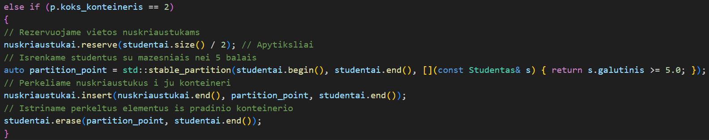

### 1) Testuosiu 1 tūkstančio studentų failo nuskaitymo, rūšiavimo, skirstymo į dvi grupes laiką su skirtingais konteineriais, kuriant tik "nuskriaustukai".

| Konteineris | Matavimas   | 1 testas | 2 testas | 3 testas | 4 testas | 5 testas | Vidurkis |
|-------------|-------------|----------|----------|----------|----------|----------|----------|
| Vektorius   | Nuskaitymas | 0.0027 s | 0.0025 s | 0.0014 s | 0.0021 s | 0.0024 s | 0.0022 s |
| Vektorius   | Rūšiavimas  | 0.285 ms | 0.262 ms | 0.158 ms | 0.190 ms | 0.242 ms | 0.227 ms |
| Vektorius   | Skirstymas  | 0.716 ms | 0.561 ms | 0.397 ms | 0.839 ms | 0.650 ms | 0.632 ms |
| List        | Nuskaitymas | 0.0023 s | 0.0037 s | 0.0022 s | 0.0034 s | 0.0052 s | 0.0034 s |
| List        | Rūšiavimas  | 0.058 ms | 0.079 ms | 0.060 ms | 0.125 ms | 0.162 ms | 0.097 ms |
| List        | Skirstymas  | 0.471 ms | 0.456 ms | 0.560 ms | 0.716 ms | 0.869 ms | 0.614 ms |
| Deque       | Nuskaitymas | 0.0017 s | 0.0028 s | 0.0024 s | 0.0028 s | 0.0025 s | 0.0024 s |
| Deque       | Rūšiavimas  | 0.473 ms | 0.661 ms | 0.352 ms | 0.644 ms | 0.596 ms | 0.545 ms |
| Deque       | Skirstymas  | 1.120 ms | 1.313 ms | 0.702 ms | 1.232 ms | 1.109 ms | 1.095 ms |

* Paskutinio testo laikai:
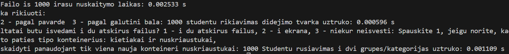

### 2) Testuosiu 10 tūkstančių studentų failo nuskaitymo, rūšiavimo, skirstymo į dvi grupes laiką su skirtingais konteineriais, kuriant tik "nuskriaustukai".

| Konteineris | Matavimas   | 1 testas | 2 testas | 3 testas | 4 testas | 5 testas | Vidurkis |
|-------------|-------------|----------|----------|----------|----------|----------|----------|
| Vektorius   | Nuskaitymas | 0.0049 s | 0.0036 s | 0.0040 s | 0.0059 s | 0.0055 s | 0.0048 s |
| Vektorius   | Rūšiavimas  | 1.304 ms | 0.912 ms | 0.789 ms | 1.267 ms | 0.777 ms | 1.009 ms |
| Vektorius   | Skirstymas  | 0.0012 s | 0.0015 s | 0.0018 s | 0.0031 s | 0.0033 s | 0.0022 s |
| List        | Nuskaitymas | 0.0048 s | 0.0045 s | 0.0026 s | 0.0049 s | 0.0052 s | 0.0044 s |
| List        | Rūšiavimas  | 0.538 ms | 0.900 ms | 1.021 ms | 0.563 ms | 1.322 ms | 0.869 ms |
| List        | Skirstymas  | 0.0019 s | 0.0027 s | 0.0028 s | 0.0039 s | 0.0031 s | 0.0029 s |
| Deque       | Nuskaitymas | 0.0067 s | 0.0090 s | 0.0077 s | 0.0076 s | 0.0080 s | 0.0078 s |
| Deque       | Rūšiavimas  | 1.663 ms | 2.440 ms | 2.138 ms | 2.099 ms | 2.840 ms | 2.236 ms |
| Deque       | Skirstymas  | 0.0098 s | 0.0160 s | 0.0152 s | 0.0158 s | 0.0159 s | 0.0145 s |

### 3) Testuosiu 100 tūkstančių studentų failo nuskaitymo, rūšiavimo, skirstymo į dvi grupes laiką su skirtingais konteineriais, kuriant tik "nuskriaustukai".

| Konteineris | Matavimas   | 1 testas | 2 testas | 3 testas | 4 testas | 5 testas | Vidurkis |
|-------------|-------------|----------|----------|----------|----------|----------|----------|
| Vektorius   | Nuskaitymas | 0.1598 s | 0.1549 s | 0.1551 s | 0.1580 s | 0.1554 s | 0.1566 s |
| Vektorius   | Rūšiavimas  | 0.0209 s | 0.0190 s | 0.0187 s | 0.0206 s | 0.0205 s | 0.0199 s |
| Vektorius   | Skirstymas  | 0.0135 s | 0.0111 s | 0.0134 s | 0.0110 s | 0.0134 s | 0.0125 s |
| List        | Nuskaitymas | 0.3217 s | 0.3245 s | 0.3367 s | 0.3420 s | 0.3252 s | 0.3300 s |
| List        | Rūšiavimas  | 0.0066 s | 0.0066 s | 0.0067 s | 0.0077 s | 0.0068 s | 0.0069 s |
| List        | Skirstymas  | 0.0634 s | 0.0649 s | 0.0541 s | 0.0636 s | 0.0586 s | 0.0609 s |
| Deque       | Nuskaitymas | 0.1785 s | 0.1628 s | 0.1727 s | 0.1734 s | 0.1835 s | 0.1742 s |
| Deque       | Rūšiavimas  | 0.0515 s | 0.0534 s | 0.0569 s | 0.0553 s | 0.0508 s | 0.0535 s |
| Deque       | Skirstymas  | 0.0511 s | 0.0517 s | 0.0514 s | 0.0547 s | 0.0541 s | 0.0526 s |

* Paskutinis List testavimas:
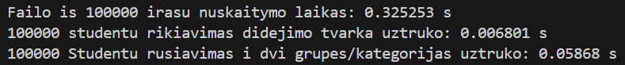

### 4) Testuosiu 1 milijono studentų failo nuskaitymo, rūšiavimo, skirstymo į dvi grupes laiką su skirtingais konteineriais, kuriant tik "nuskriaustukai".

| Konteineris | Matavimas   | 1 testas | 2 testas | 3 testas | 4 testas | 5 testas | Vidurkis |
|-------------|-------------|----------|----------|----------|----------|----------|----------|
| Vektorius   | Nuskaitymas | 0.7573 s | 0.7411 s | 0.7576 s | 0.7571 s | 0.7659 s | 0.7558 s |
| Vektorius   | Rūšiavimas  | 0.2727 s | 0.3057 s | 0.2724 s | 0.2793 s | 0.2820 s | 0.2824 s |
| Vektorius   | Skirstymas  | 0.1097 s | 0.1190 s | 0.1087 s | 0.1057 s | 0.1105 s | 0.1107 s |
| List        | Nuskaitymas | 1.3932 s | 1.5374 s | 1.2863 s | 1.2902 s | 1.3216 s | 1.3657 s |
| List        | Rūšiavimas  | 0.1271 s | 0.1302 s | 0.1077 s | 0.1184 s | 0.1207 s | 0.1208 s |
| List        | Skirstymas  | 0.2959 s | 0.3114 s | 0.2603 s | 0.2622 s | 0.2668 s | 0.2793 s |
| Deque       | Nuskaitymas | 1.0458 s | 0.9006 s | 0.9008 s | 0.9908 s | 0.8972 s | 0.9470 s |
| Deque       | Rūšiavimas  | 0.7465 s | 0.6755 s | 0.6885 s | 0.7466 s | 0.6666 s | 0.7047 s |
| Deque       | Skirstymas  | 0.6996 s | 0.6126 s | 0.6361 s | 0.7129 s | 0.6620 s | 0.6646 s |

* Paskutinis Deque testavimas:
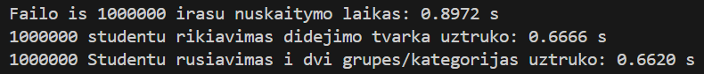

### 5) Testuosiu 10 milijono studentų failo nuskaitymo, rūšiavimo, skirstymo į dvi grupes laiką su skirtingais konteineriais, kuriant tik "nuskriaustukai".

| Konteineris | Matavimas   | 1 testas | 2 testas | 3 testas | 4 testas | 5 testas | Vidurkis |
|-------------|-------------|----------|----------|----------|----------|----------|----------|
| Vektorius   | Nuskaitymas | 6.5511 s | 6.5167 s | 6.5223 s | 6.5669 s | 6.9504 s | 6.6215 s |
| Vektorius   | Rūšiavimas  | 3.7443 s | 3.3765 s | 3.3638 s | 3.5856 s | 3.8797 s | 3.5899 s |
| Vektorius   | Skirstymas  | 1.1952 s | 1.1281 s | 1.1548 s | 1.2840 s | 1.2826 s | 1.2089 s |
| List        | Nuskaitymas | 11.907 s | 11.326 s | 11.307 s | 11.443 s | 11.965 s | 11.589 s |
| List        | Rūšiavimas  | 1.5899 s | 1.5766 s | 1.5652 s | 1.5619 s | 1.6748 s | 1.5937 s |
| List        | Skirstymas  | 2.7839 s | 2.5069 s | 2.5780 s | 2.6779 s | 2.7736 s | 2.6641 s |
| Deque       | Nuskaitymas | 9.3299 s | 8.4383 s | 8.3337 s | 8.4242 s | 8.2841 s | 8.5620 s |
| Deque       | Rūšiavimas  | 9.3203 s | 9.3364 s | 9.5307 s | 9.3106 s | 9.2053 s | 9.3407 s |
| Deque       | Skirstymas  | 7.4268 s | 7.0624 s | 7.5327 s | 6.7767 s | 6.8542 s | 7.1306 s |

* Paskutinis Deque testavimas:
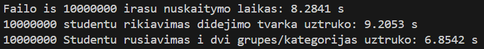

* Pastebime, kad rūšiavimas ir skirstymas yra labai neefektyvus procesas su Deque konteineriu.
* Antros strategijos skirstymas dažniausiai yra lėtesnis naudojant List ir ypatingai Deque, bet kartais yra truputi greitesnis su Vector konteineriu.

### Antros strategijos studentų skirstymo į dvi grupes vietoje aš iš tikro panaudojau 3 strategijos std::stable_partition, nes kitaip man neišėjo.
* Tačiau vis tiek galiu dar labiau pabandyti paoptimizuoti skirstymą su std::copy_if ir std::partition_copy skaidant bendrą konteinerį į du naujus.

## 3 strategijos tyrimas
### Optimizuoju skirstymą su std::copy_if ir std::partition_copy skaidant bendrą konteinerį į du naujus.

### 1) Testuosiu 1 tūkstančio studentų failo nuskaitymo, rūšiavimo, skirstymo į dvi naujas grupes laiką su skirtingais konteineriais (3 strategija).

| Konteineris | Matavimas   | 1 testas | 2 testas | 3 testas | 4 testas | 5 testas | Vidurkis |
|-------------|-------------|----------|----------|----------|----------|----------|----------|
| Vektorius   | Skirstymas  | 0.0004 s | 0.0005 s | 0.0019 s | 0.0013 s | 0.0035 s | 0.0015 s |
| List        | Skirstymas  | 0.0018 s | 0.0027 s | 0.0022 s | 0.0023 s | 0.0025 s | 0.0023 s |
| Deque       | Skirstymas  | 0.0007 s | 0.0019 s | 0.0016 s | 0.0026 s | 0.0030 s | 0.0020 s |

### 2) Testuosiu 10 tūkstančių studentų failo nuskaitymo, rūšiavimo, skirstymo į dvi naujas grupes laiką su skirtingais konteineriais (3 strategija).

| Konteineris | Matavimas   | 1 testas | 2 testas | 3 testas | 4 testas | 5 testas | Vidurkis |
|-------------|-------------|----------|----------|----------|----------|----------|----------|
| Vektorius   | Skirstymas  | 0.0014 s | 0.0049 s | 0.0034 s | 0.0025 s | 0.0032 s | 0.0031 s |
| List        | Skirstymas  | 0.0023 s | 0.0034 s | 0.0035 s | 0.0032 s | 0.0026 s | 0.0030 s |
| Deque       | Skirstymas  | 0.0045 s | 0.0115 s | 0.0065 s | 0.0075 s | 0.0101 s | 0.0080 s |

* Paskutinis Deque testavimas:

### 3) Testuosiu 100 tūkstančių studentų failo nuskaitymo, rūšiavimo, skirstymo į dvi naujas grupes laiką su skirtingais konteineriais (3 strategija).

| Konteineris | Matavimas   | 1 testas | 2 testas | 3 testas | 4 testas | 5 testas | Vidurkis |
|-------------|-------------|----------|----------|----------|----------|----------|----------|
| Vektorius   | Skirstymas  | 0.0259 s | 0.0262 s | 0.0247 s | 0.0249 s | 0.0245 s | 0.0252 s |
| List        | Skirstymas  | 0.1446 s | 0.1421 s | 0.1441 s | 0.1394 s | 0.1492 s | 0.1439 s |
| Deque       | Skirstymas  | 0.0660 s | 0.0740 s | 0.0656 s | 0.0637 s | 0.0650 s | 0.0669 s |

* Paskutinis Deque testavimas:
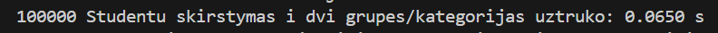

### 4) Testuosiu 1 milijono studentų failo nuskaitymo, rūšiavimo, skirstymo į dvi naujas grupes laiką su skirtingais konteineriais (3 strategija).

| Konteineris | Matavimas   | 1 testas | 2 testas | 3 testas | 4 testas | 5 testas | Vidurkis |
|-------------|-------------|----------|----------|----------|----------|----------|----------|
| Vektorius   | Skirstymas  | 0.1916 s | 0.1916 s | 0.1881 s | 0.2025 s | 0.1962 s | 0.1940 s |
| List        | Skirstymas  | 0.6241 s | 0.6367 s | 0.6788 s | 0.5664 s | 0.6010 s | 0.6214 s |
| Deque       | Skirstymas  | 0.5776 s | 0.6110 s | 0.6007 s | 0.6209 s | 0.6194 s | 0.6059 s |

* Paskutinis Deque testavimas:

### 5) Testuosiu 10 milijonų studentų failo nuskaitymo, rūšiavimo, skirstymo į dvi naujas grupes laiką su skirtingais konteineriais (3 strategija).

| Konteineris | Matavimas   | 1 testas | 2 testas | 3 testas | 4 testas | 5 testas | Vidurkis |
|-------------|-------------|----------|----------|----------|----------|----------|----------|
| Vektorius   | Skirstymas  | 2.2186 s | 2.2722 s | 2.3623 s | 2.4343 s | 2.4951 s | 2.3565 s |
| List        | Skirstymas  | 5.9380 s | 5.1058 s | 5.4631 s | 5.3478 s | 5.2896 s | 5.4289 s |
| Deque       | Skirstymas  | 7.6150 s | 8.5334 s | 6.7577 s | 6.7577 s | 6.4516 s | 7.2231 s |

* Paskutinis Deque testavimas:
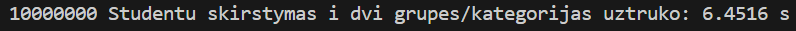

### Taigi matome, kad 3 strategija lėtesnė nei 2 ir 1 strategija.

# Kaip įdiegti
1) Pasirinkite Vector ar List ar Deque programos aplanką, naudojant šias komandas terminale:
    * cd Vector Arba cd List Arba cd Deque
2) Sukurkite build aplanką ir įeikite į jį, naudojant šias komandas terminale:
    * mkdir build 
    * cd build
3) Paleiskite cmake, naudojant šias komandas terminale:
    * cmake ..
4) Išeikite iš aplankalo ir sukompiliuokite programą, naudojant šias komandas terminale:
    * cd ..
    * cmake --build build
5) Programa bus build/debug aplanke su pavadinimu "v1.0_uzduotis.exe".
6) Tada galėsite paleisti executable.

# struct ir class palyginimas, tyrimai:

    * Palyginsime greičius su -O1, -O2 ir -O3 vėliavėlėmis.
    * Testavimui naudosime tik 1 ir 10 milijonų studentų failus.
    * Matuosime visos programos veikimo laiką, neįskaitant vartotojo duomenų įvesties laiko.
    * Naudosiu pirmą (1) strategiją, kad testuoti greičius.

## Programos veikimo greičio su -O1 testavimas

| Stud.sk/Duomenų tipas   | 1 testas | 2 testas | 3 testas | 4 testas | 5 testas | Vidurkis |
|-------------------------|----------|----------|----------|----------|----------|----------|
| 1 milijonas / class     | 6.8223 s | 6.9257 s | 6.8526 s | 6.5403 s | 6.6768 s | 6.7635 s |
| 1 milijonas / struct    | 6.1602 s | 6.1610 s | 6.0750 s | 6.0470 s | 6.0996 s | 6.1086 s |
| 10 milijonų / class     | 74.869 s | 77.282 s | 76.083 s | 76.903 s | 75.671 s | 76.162 s |
| 10 milijonų / struct    | 62.441 s | 57.489 s | 62.013 s | 61.107 s | 60.523 s | 60.715 s |

Klasės .exe failo dydis: 3.162 KB. Struktūros .exe failo dydis: 3.163 KB.

## Programos veikimo greičio su -O2 testavimas

| Stud.sk/Duomenų tipas   | 1 testas | 2 testas | 3 testas | 4 testas | 5 testas | Vidurkis |
|-------------------------|----------|----------|----------|----------|----------|----------|
| 1 milijonas / class     | 6.5051 s | 6.3632 s | 6.4580 s | 6.5346 s | 6.5438 s | 6.4809 s |
| 1 milijonas / struct    | 5.9997 s | 5.9901 s | 5.7390 s | 6.0790 s | 5.8582 s | 5.9332 s |
| 10 milijonų / class     | 73.144 s | 72.125 s | 71.557 s | 73.392 s | 73.284 s | 72.700 s |
| 10 milijonų / struct    | 59.897 s | 61.172 s | 60.671 s | 61.792 s | 60.832 s | 60.873 s |

Klasės .exe failo dydis: 3.164 KB. Struktūros .exe failo dydis: 3.168 KB.

## Programos veikimo greičio su -O3 testavimas

| Stud.sk/Duomenų tipas   | 1 testas | 2 testas | 3 testas | 4 testas | 5 testas | Vidurkis |
|-------------------------|----------|----------|----------|----------|----------|----------|
| 1 milijonas / class     | 6.3353 s | 6.6236 s | 6.3143 s | 6.6149 s | 6.6479 s | 6.5072 s |
| 1 milijonas / struct    | 6.0467 s | 6.1405 s | 5.5989 s | 5.9337 s | 5.7202 s | 5.8880 s |
| 10 milijonų / class     | 72.901 s | 72.158 s | 73.451 s | 74.351 s | 74.699 s | 73.512 s |
| 10 milijonų / struct    | 59.576 s | 57.394 s | 58.490 s | 57.158 s | 57.183 s | 57.960 s |

Klasės .exe failo dydis: 3.196 KB. Struktūros .exe failo dydis: 3.197 KB.

### Taigi matome, kad struktūros testai buvo greitesni ir -O3 buvo greičiausias beveik visada.

# v1.2 Tyrimai (greitis su perdengtais operatoriais ir be)
### Šiuos perdengtus operatorius naudosiu greičio teste:
* įvesties;
* failo nuskaitymo;
* išvesties;
* failo išvesties.
### Naudosiu pirmą strategiją greičiams matuoti.
### Naudosiu -O3 flag.
### Perdarysiu testus ir be operatorių perdengimo, nes pakeičiau kode bereikalingus std::endl su "\n".
### Ši kodo vieta leidžia pasirinkti, ar naudoti perdengtus operatorius, ar ne:
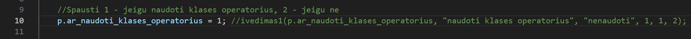

## v1.2 greičio tyrimas su 1 milijonu ir 10 milijonų studentų:

| Stud.sk/Operatorius     | 1 testas | 2 testas | 3 testas | 4 testas | 5 testas | Vidurkis |
|-------------------------|----------|----------|----------|----------|----------|----------|
| 1 milijonas / be oper.  | 2.1869 s | 2.2442 s | 2.3407 s | 2.2601 s | 2.5255 s | 2,3115 s |
| 1 milijonas / su oper.  | 2.2164 s | 2.2581 s | 2.2541 s | 2.2703 s | 2.1906 s | 2.3244 s |
| 10 milijonų / be oper.  | 23.347 s | 23.189 s | 23.001 s | 23.798 s | 23.887 s | 23.444 s |
| 10 milijonų / su oper.  | 23.652 s | 24.038 s | 24.068 s | 23.806 s | 23.821 s | 23.877 s |

### Paskutinis 1 milijono studentų su operatorių perdengimu testas:
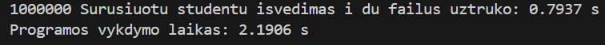
### Paskutinis 10 milijonų studentų su operatorių perdengimu testas:
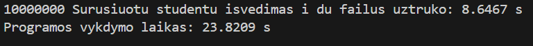 
### Taigi matome, kad testai su operatorių perdengimu buvo vos lėtesni, nei be, bet galima sakyti beveik vienodi.

# v1.5 Tyrimai
### Kaip matome, negalime sukurti Zmogus klasės objektų, nes ši klasė yra abstrakti:
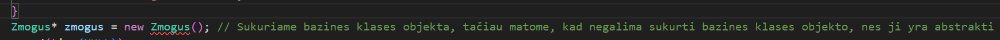
### Programa išliko veiksni naudojant v1.2 logiką.
### Naudosiu pirmą strategiją greičiams matuoti.
### Naudosiu -O3 flag.

### v1.5 greičio tyrimas su 1 milijonu ir 10 milijonų studentų:

| Stud.sk/Operatorius         | 1 testas | 2 testas | 3 testas | 4 testas | 5 testas | Vidurkis |
|-----------------------------|----------|----------|----------|----------|----------|----------|
| 1 milijonas / be oper.      | 2.1869 s | 2.2442 s | 2.3407 s | 2.2601 s | 2.5255 s | 2,3115 s |
| 1 milijonas / su oper. v1.2 | 2.2164 s | 2.2581 s | 2.2541 s | 2.2703 s | 2.1906 s | 2.3244 s |
| 1 milijonas / su oper. v1.5 | 3.0894 s | 2.9806 s | 3.0065 s | 3.2908 s | 2.4853 s | 2.9705 s |
| 10 milijonų / be oper.      | 23.347 s | 23.189 s | 23.001 s | 23.798 s | 23.887 s | 23.444 s |
| 10 milijonų / su oper. v1.2 | 23.652 s | 24.038 s | 24.068 s | 23.806 s | 23.821 s | 23.877 s |
| 10 milijonų / su oper. v1.5 | 27.407 s | 25.158 s | 25.121 s | 24.679 s | 24.695 s | 25.412 s |

### Paskutinis 1 milijono studentų su v1.5 operatorių perdengimu testas:
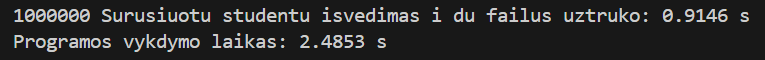 
### Paskutinis 10 milijonų studentų su v1.5 operatorių perdengimu testas:
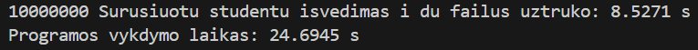
### Taigi matome, kad v1.5 testai buvo lėtesni nei v1.2 ir be operatorių perdengimo.

# v3.0 Vektoriaus kūrimas ir testai
### Reikia kompiliuoti su C++20, nes naudojau construct_at() ir destroy_at() metodus, kad realizuoti vektorių.
## 5 Skirtingų Vector.h funkcijų aprašymas:
### 1. void reserve(std::size_t new_cap) :
* Užtikrina, kad vidinis masyvas turėtų bent new_cap vietų. 
* Jeigu reikia, alokuoja naują bloką, perkelia (move) egzistuojančius elementus ir atnaujina _capacity, bet nedidina _size.
### 2. void resize(std::size_t new_size) :
* Pakeičia logišką vektoriaus ilgį _size. Mažinant – sunaikina ( std::destroy_at) perteklinius objektus; 
* didinant – sukuria naujų (default-konstruoja) ir prireikus iškviečia reserve, kad atmintis tilptų.
### 3. iterator insert(const_iterator pos, const T& value) :
* Įterpia vieną elementą nurodytoje pozicijoje.  
* Prireikus plečia talpą, tada perkelia visus elementus į dešinę ir galiausiai konstruoja naują kopiją value; grąžina iteratorių į įterptą elementą.
### 4. 	template <R> void assign_range(R&& rg) :
* C++20 diapazonų (Ranges) pagrindu pakeičia visą vektoriaus turinį nauju intervalu. 
* Naudoja std::ranges::distance, begin ir static_assert, kad kompiliavimo metu tikrintų, ar R yra bent jau input-range ir kad iš jo elementų galima konstruoti T.
### 5. template <R> void append_range(R&& rg) :
* Prideda kiekvieną elemento nuorodą iš Ranges intervalo į vektoriaus galą. 
* Dinamiškai perskaičiuoja vietos poreikį, prireikus iškviečia reserve, o kiekvieną naują objektą sukonstruoja vietoje (std::construct_at) su std::forward.

# Efektyvumo/spartos analizė - Vector.h VS std::vector
### Užpildysime int elementais su push_back()

## 10 tūkst. elementų:

| Konteineris | Matavimas   | 1 testas | 2 testas | 3 testas | 4 testas | 5 testas | Vidurkis |
|-------------|-------------|----------|----------|----------|----------|----------|----------|
| std::vector | Užpildymas  | 6.1e-05 s| 9.1e-05 s| 5.4e-05 s| 4.9e-05 s| 7.1e-05 s| 6.3e-05 s|
| Vector.h    | Užpildymas  | 4.4e-05 s| 7e-05 s  | 4.6e-05 s| 6.9e-05 s| 4.5e-05 s| 5.4e-05 s|

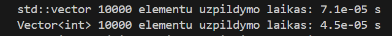

## 100 tūkst. elementų:

| Konteineris | Matavimas   | 1 testas | 2 testas | 3 testas | 4 testas | 5 testas | Vidurkis |
|-------------|-------------|----------|----------|----------|----------|----------|----------|
| std::vector | Užpildymas  | 0.0004 s | 0.0005 s | 0.0005 s | 0.0003 s | 0.0005 s | 0.0004 s |
| Vector.h    | Užpildymas  | 0.0002 s | 0.0003 s | 0.0001 s | 0.0001 s | 0.0002 s | 0.0002 s |

## 1 milijono elementų:

| Konteineris | Matavimas   | 1 testas | 2 testas | 3 testas | 4 testas | 5 testas | Vidurkis |
|-------------|-------------|----------|----------|----------|----------|----------|----------|
| std::vector | Užpildymas  | 0.0030 s | 0.0027 s | 0.0021 s | 0.0026 s | 0.0030 s | 0.0027 s |
| Vector.h    | Užpildymas  | 0.0023 s | 0.0024 s | 0.0027 s | 0.0022 s | 0.0024 s | 0.0024 s |

## 10 milijonų elementų:

| Konteineris | Matavimas   | 1 testas | 2 testas | 3 testas | 4 testas | 5 testas | Vidurkis |
|-------------|-------------|----------|----------|----------|----------|----------|----------|
| std::vector | Užpildymas  | 0.0277 s | 0.0207 s | 0.0207 s | 0.0224 s | 0.0235 s | 0.0230 s |
| Vector.h    | Užpildymas  | 0.0270 s | 0.0319 s | 0.0318 s | 0.0321 s | 0.0344 s | 0.0314 s |

### 100 milijonų elementų

| Konteineris | Matavimas   | 1 testas | 2 testas | 3 testas | 4 testas | 5 testas | Vidurkis |
|-------------|-------------|----------|----------|----------|----------|----------|----------|
| std::vector | Užpildymas  | 0.1976 s | 0.1872 s | 0.1980 s | 0.1894 s | 0.2143 s | 0.1639 s |
| Vector.h    | Užpildymas  | 0.2225 s | 0.1933 s | 0.2078 s | 0.1973 s | 0.2032 s | 0.1718 s |

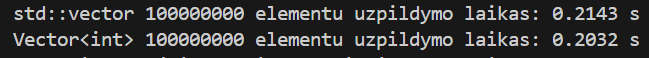

## Kiek kartų įvyksta konteinerių (Vector ir std::vector) atminties perskirstymai užpildant 100000000 elementų:
* Atsakymas - 28
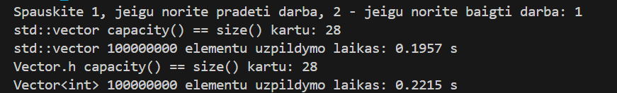

# Spartos analizė su 100 tūkst, 1 mil. ir 10 mil. studentų su std::vector ir Vector.h.
### Testuosiu nuskaitymą, rūšiavimą ir skirstymą.

## std::vector VS Vector.h su 100 tūkst. studentų:

| Konteineris | Matavimas   | 1 testas | 2 testas | 3 testas | 4 testas | 5 testas | Vidurkis |
|-------------|-------------|----------|----------|----------|----------|----------|----------|
| std::vector | Nuskaitymas | 0.1598 s | 0.1549 s | 0.1551 s | 0.1580 s | 0.1554 s | 0.1566 s |
| std::vector | Rūšiavimas  | 0.0209 s | 0.0190 s | 0.0187 s | 0.0206 s | 0.0205 s | 0.0199 s |
| std::vector | Skirstymas  | 0.0135 s | 0.0111 s | 0.0134 s | 0.0110 s | 0.0134 s | 0.0125 s |
| Vector.h    | Nuskaitymas | 0.1780 s | 0.1803 s | 0.1755 s | 0.1760 s | 0.1763 s | 0.1772 s |
| Vector.h    | Rūšiavimas  | 0.0425 s | 0.0425 s | 0.0418 s | 0.0420 s | 0.0422 s | 0.0423 s |
| Vector.h    | Skirstymas  | 0.0259 s | 0.0370 s | 0.0267 s | 0.0274 s | 0.0246 s | 0.0283 s |

## std::vector VS Vector.h su 1 milijono studentų:

| Konteineris | Matavimas   | 1 testas | 2 testas | 3 testas | 4 testas | 5 testas | Vidurkis |
|-------------|-------------|----------|----------|----------|----------|----------|----------|
| std::vector | Nuskaitymas | 0.7573 s | 0.7411 s | 0.7576 s | 0.7571 s | 0.7659 s | 0.7558 s |
| std::vector | Rūšiavimas  | 0.2727 s | 0.3057 s | 0.2724 s | 0.2793 s | 0.2820 s | 0.2824 s |
| std::vector | Skirstymas  | 0.1097 s | 0.1190 s | 0.1087 s | 0.1057 s | 0.1105 s | 0.1107 s |
| Vector.h    | Nuskaitymas | 0.8674 s | 0.8554 s | 0.8796 s | 0.8732 s | 0.8855 s | 0.8722 s |
| Vector.h    | Rūšiavimas  | 0.5647 s | 0.5694 s | 0.5808 s | 0.5685 s | 0.5819 s | 0.5731 s |
| Vector.h    | Skirstymas  | 0.2288 s | 0.2278 s | 0.2262 s | 0.2339 s | 0.2389 s | 0.2311 s |

## std::vector VS Vector.h su 10 milijonų studentų:

| Konteineris | Matavimas   | 1 testas | 2 testas | 3 testas | 4 testas | 5 testas | Vidurkis |
|-------------|-------------|----------|----------|----------|----------|----------|----------|
| std::vector | Nuskaitymas | 6.5511 s | 6.5167 s | 6.5223 s | 6.5669 s | 6.9504 s | 6.6215 s |
| std::vector | Rūšiavimas  | 3.7443 s | 3.3765 s | 3.3638 s | 3.5856 s | 3.8797 s | 3.5899 s |
| std::vector | Skirstymas  | 1.1952 s | 1.1281 s | 1.1548 s | 1.2840 s | 1.2826 s | 1.2089 s |
| Vector.h    | Nuskaitymas | 8.8516 s | 8.8066 s | 8.9238 s | 9.0785 s | 8.9383 s | 8.9198 s |
| Vector.h    | Rūšiavimas  | 7.2263 s | 7.1596 s | 7.0794 s | 7.3151 s | 7.2430 s | 7.2047 s |
| Vector.h    | Skirstymas  | 2.2535 s | 2.2697 s | 2.4012 s | 2.4283 s | 2.5432 s | 2.3792 s |

# Setup.exe instrukcija
## Diegimo failai
* Kataloge rasite šiuos failus:

* Setup.exe

* Setup.msi

* 100tukst_stud.txt

* 10tukst_stud.txt

### Šie failai turi būti laikomi viename kataloge diegimo metu.

## Kaip įdiegti programą
### Paleiskite Setup.exe kaip administratorių:

* Dešiniu pelės mygtuku ant Setup.exe

* Pasirinkite Run as administrator

* Programa bus įdiegta į katalogą:

* C:\Program Files\VU\Povilas-Jurgulis\

### Diegimo metu susikurs:

* Nuoroda darbalaukyje

* Nuoroda Start Menu aplanke: VU -> Povilas-Jurgulis