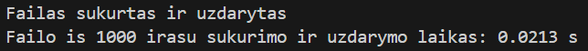
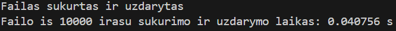

# v0.4 Tyrimai
## 1 Tyrimas:
* Laikui skaičiuoti naudoju chrono biblioteka ir Timer klasę.
* Naudoju -O3 vėliavėlę kompiliavimui.
### 1) Testuosiu 1 tūkstančio studentų failo sukūrimo ir uždarymo laiką.
* Kai yra 1 tūkstantis studentų, kiekvienas turi po 10 namų darbų ir vieną egzamino rezultatą.
* Pirmas bandymas:

* 1 tūkst. studentų generavimo laiko testavimų lentelė

| 1 testas | 2 testas | 3 testas | 4 testas | 5 testas |
|----------|----------|----------|----------|----------|
| 0.0213 s | 0.0113 s | 0.0130 s | 0.0109 s | 0.0101 s |

### 2) Testuosiu 10 tūkstančių studentų failo sukūrimo ir uždarymo laiką.
* Kai yra 10 tūkstančių studentų, kiekvienas turi po 15 namų darbų ir vieną egzamino rezultatą.
* Pirmas bandymas:

* 10 tūkst. studentų generavimo laiko testavimų lentelė

| 1 testas | 2 testas | 3 testas | 4 testas | 5 testas |
|----------|----------|----------|----------|----------|
| 0.0407 s | 0.0408 s | 0.0482 s | 0.0565 s | 0.0385 s |

### 3) Testuosiu 100 tūkstančių studentų failo sukūrimo ir uždarymo laiką.
* Kai yra 100 tūkstančių studentų, kiekvienas turi po 20 namų darbų ir vieną egzamino rezultatą.
* Pirmas bandymas:

* 100 tūkst. studentų generavimo laiko testavimų lentelė

| 1 testas | 2 testas | 3 testas | 4 testas | 5 testas |
|----------|----------|----------|----------|----------|
| 0.2945 s | 0.2831 s | 0.2908 s | 0.2855 s | 0.2829 s |

### 4) Testuosiu 1 milijono studentų failo sukūrimo ir uždarymo laiką.
* Kai yra 1 milijonas studentų, kiekvienas turi po 7 namų darbus ir vieną egzamino rezultatą.
* Pirmas bandymas:

* 1 milijono studentų generavimo laiko testavimų lentelė

| 1 testas | 2 testas | 3 testas | 4 testas | 5 testas |
|----------|----------|----------|----------|----------|
| 2.2452 s | 2.1820 s | 2.1587 s | 2.3350 s | 2.2060 s |

### 5) Testuosiu 10 milijonų studentų failo sukūrimo ir uždarymo laiką.
* Kai yra 10 milijonų studentų, kiekvienas turi po 5 namų darbus ir vieną egzamino rezultatą.
* Pirmas bandymas:

* 10 milijonų studentų generavimo laiko testavimų lentelė

| 1 testas | 2 testas | 3 testas | 4 testas | 5 testas |
|----------|----------|----------|----------|----------|
| 20.786 s | 22.255 s | 21.093 s | 20.908 s | 21.502 s |