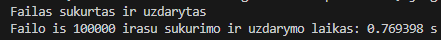

# v0.4 Tyrimai
## 1 Tyrimas:
* Testuosiu 100 tūkstančių studentų failo sukūrimą ir uždarymą.
* Kai yra 100 tūkstančių studentų, kiekvienas turi po 20 namų darbų ir vieną egzamino rezultatą.
* Laikui skaičiuoti naudoju chrono biblioteka ir Timer klasę.
* Pirmas bandymas:

* Bandymų (testavimų) lentelė

| 1 testas | 2 testas | 3 testas | 4 testas | 5 testas |
|----------|----------|----------|----------|----------|
| 0.7693 s | 0.5685 s | 0.6599 s | 0.6386 s | 0.6382 s |

test change